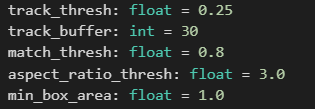

# Vehicle Tracking and Numberplate Recognition
- The main task of the project is to track the vehicles present in the video using bounding boxes and naming the class of the vehicle, and also a side task will be to extract the number plate text on the vehicle present in a particular frame. It is an emerging technology that aims to improve traffic management, enhance law enforcement and provide security for vehicles.
- ## Install Dependencies
- Using requirement.txt
- Ex: easyocr, keras, colorsys, ultralytics, etc.

- ## DeepSORT Tracking
- 

- Run the cells within the heading DeepSORT Approach
- Check for best parameters by changing WIDTH, class_threshold or the yolo architechture parameters
- Save the final model 
- Run the cells having instances for detection and Tracking
- Run the final snippet in the heading, which will process the input video and give output

- ## ByteTrack Tracking
- 

- Run the cells within the heading ByteTrack Approach
- Check for best parameters by changing these:
- 
- Run the cells having instances for detection and Tracking
- Run the final snippet in the heading, which will process the input video and give output

- ## Numberplate Extraction
-  upload your frame named as demo img 
-  Run all code snippets under the heading OCR Maps
-  Get output frame with Numberplate detection

### Result

https://github.com/PramodK1953/Vehicle-Tracking-and-Numberplate-Recognition/assets/100599464/e34ebe77-6e8a-45e1-b51b-d5dcfb2a2fef

